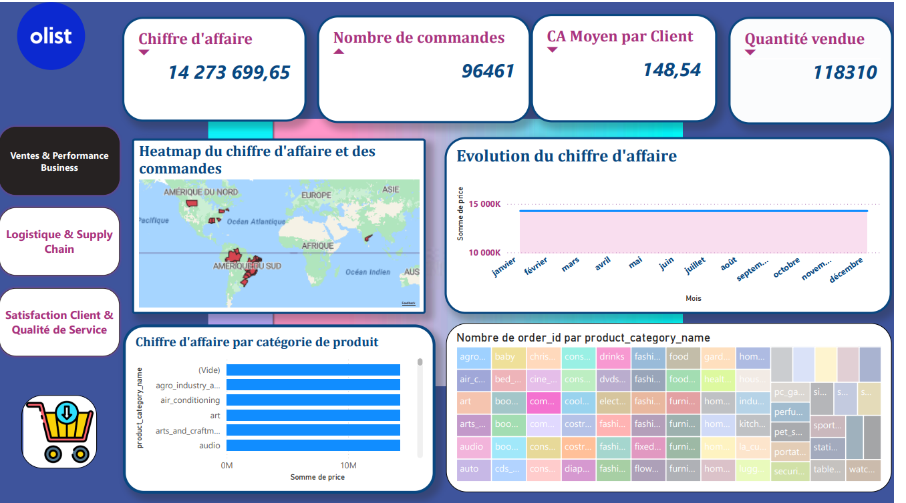

# Data Warehouse – Analyse des ventes et satisfaction client

## Description
Ce projet consiste à mettre en place un **Data Warehouse** afin d’analyser les **ventes**, le **comportement des clients** et la **satisfaction client**, puis à créer des **tableaux de bord Power BI** pour faciliter la prise de décision.

---

## Objectifs
- Centraliser les données
- Nettoyer et structurer les données
- Analyser les ventes et la satisfaction client
- Visualiser les résultats avec Power BI

---

## Données
- Commandes
- Clients
- Produits
- Avis clients (scores de 1 à 5)

---

## Outils utilisés
- Power BI
- Power Query
- SQL
- GitHub

---

## Résultats
- Tableaux de bord interactifs
- Indicateurs clés sur les ventes
- Analyse de la satisfaction client

---

## Auteur
Judicaël Oscar Gandwende KAFANDO
Ramatoulaye NDEYE NDOYE FALL
Djerakei MISTALENGAR
Ben Idriss Diloma SOMA
Moussa DIEME
ENSAE Dakar
